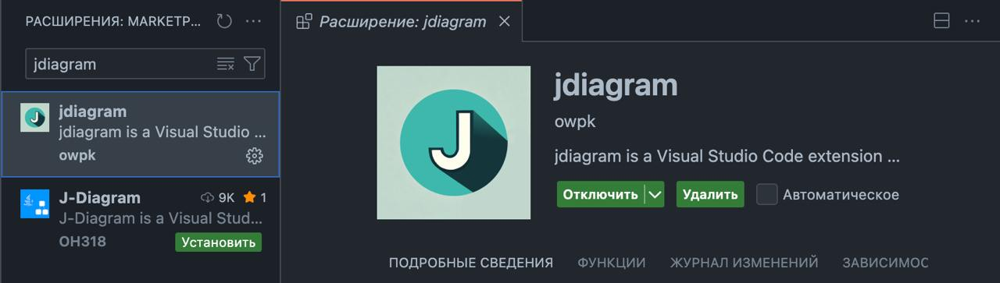

<div align="center">
   
</div>

# Java UML diagram generator 📊

[](https://marketplace.visualstudio.com/items?itemName=owpk.juml)
[](LICENSE)

> ⚠️ **IMPORTANT!!!**: The plugin **requires Java SE 17** or higher to work!

## 🎯 Overview
juml is an extension for Visual Studio Code that helps Java developers visualize the architecture of the project. The plugin provides convenient conversion between Java source code and class diagram.

## ✨ Features
- 🔄 Convert source code to uml diagram
- 📁 Support for both individual files and entire directories
- 🎨 Integration with Draw.io
- 🎯 Automatic recognition of relationships between classes
- 📊 Support for all major UML elements

## 🛠 Dependencies
- [Draw.io Integration](https://marketplace.visualstudio.com/items?itemName=hediet.vscode-drawio)
- Java SE >= 17 (required!)

## 💻 Supported Environments
- Windows
- MacOS
- Linux

## 🚀 Getting Started

### Installation

1. Make sure you have Java 17 or higher installed

```bash
java -version
```
2. Install juml from Visual Studio Code Marketplace


### Create a diagram from Java code
- Open the command palette (`Cmd+Shift+P on macOS` or `Ctrl+Shift+P on Windows/Linux`)
- Type `juml : Convert Source to Diagram`
- Select the path to the Java sources
---

## 🔨 Development
Build from sources
1. Clone the repository:
```sh
git clone https://github.com/your-username/juml.git
cd juml
```
2. Build the project:
```sh
./gradlew clean build
```
Run from command line
```sh
java -jar juml.jar -s <source-path> -t <target-path>
```
## 📝 Contributing
Any contribution to the development of the project is welcome!
1. Fork the repository
2. Create a branch for the new functionality
3. Create a Pull Request

🐛 Known Issues
- Limitations when working with generic types
- Need to improve the accuracy of the recognition of relationships between classes

## 📄 License
MIT License - details in the LICENSE file

## 🙏 Acknowledgments
- [Draw.io](https://www.drawio.com/) for a great visualization tool
- [Roaster](https://github.com/forge/roaster) for parsing Java code
---
If you have any problems or suggestions for improvement, create an [Issue](https://github.com/owpk/juml/issues).